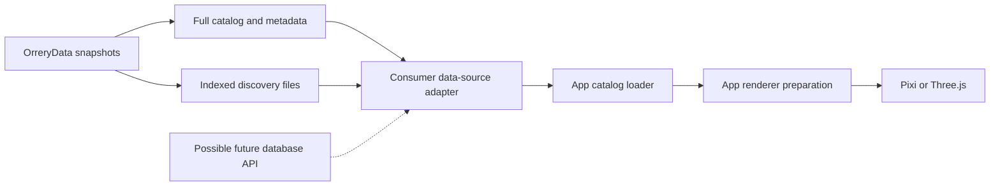

# Consumer delivery plan and contract

Status: **approved exploration; producer trial implementation in this branch**.
Recorded 13 September 2026. Owners: OrreryData, Orrery and Orrery3D.

The [concrete experimental contract v1](consumer-contract.md) and common fixtures
now accompany an optional `export-indexed` command. The source export and release
schema remain unchanged. This is producer-side trial support; both consumers'
adapter/loader adoption and conformance are pending. The rest of this document
retains the exploration sequence and its production acceptance gates.

OrreryData will supply versioned catalog information and discovery-ordered data.
Each consumer will use interchangeable data-source adapters, keeping loading
policy and renderer preparation separate. We will compare whole-file loading
with indexed, on-demand files before choosing a production default.

The user expects that a service backed by a database **may become the eventual
direction**. Preserve that migration path. A dedicated Ubuntu server is available
according to the user, but no service, server access or deployment is activated
by this plan. Static delivery is the first experiment, not a permanent
architectural commitment.

This document records the agreed exploration and its scope. The companion
contract fixes descriptor fields and adapter operations for the producer trial;
consumer conformance/acknowledgement remains part of milestone 1. Publication
and app rollout remain later milestones.

## 1. Ownership and boundaries

| Owner | Responsibility |
| --- | --- |
| OrreryData | Acquire and validate MPC sources; retain complete snapshots; produce full and indexed discovery exports, catalog metadata, versions, checksums and attribution; own the documented data contract and shared conformance fixtures. |
| Orrery | Implement and evaluate its source adapters and loading policy; prepare records for Pixi; preserve its playback, discovery markers, controls and graphics lifecycle. |
| Orrery3D | Implement and evaluate its source adapters and loading policy; prepare records for Three.js; preserve its playback, discovery markers, controls and graphics lifecycle. |
| All three | Agree contract changes, compare fixture results and coordinate compatibility. A producer change does not demonstrate consumer adoption. |

The adapters are **consumer runtime code**, not a browser package to add to
OrreryData. Whether the two apps later share adapter code through a small library
is undecided. Shared semantics and fixtures are required; shared packaging is not.
No shared renderer or UI design is implied.

Within each app:

- The **source adapter** obtains metadata and verified, ordered record batches.
  It handles its transport's fetch, decoding and error reporting.
- The **catalog loader** owns requested date coverage, retained batches,
  prefetch, cancellation, stale results, buffering and catalog activation.
- **Renderer preparation** converts records into app-specific buffers and owns
  GPU allocation, updates, disposal and recovery.

Worker execution can cover fetching, decoding and preparation, but does not
change these responsibilities. Switching source adapters must not require a
different playback implementation or renderer.

## 2. Options to explore

| Adapter | Behavior | Benefit | Limit / status |
| --- | --- | --- | --- |
| Whole-file | Fetch the complete selected profile on first data demand, then serve requested records. | Simple baseline; any date can use the loaded catalog. | Full initial transfer and parsing; first implementation for comparison. |
| Indexed files | Fetch independently addressable files needed through the requested date, with bounded lookahead. | Earlier complete initial scene and potentially fewer bytes for short visits. | Incremental loading and possible buffering; primary experiment. |
| Database API | Obtain metadata and ordered pages from an explicitly pinned snapshot. | Future dynamic queries and service-managed delivery. | Candidate future adapter; no server/API implementation in this milestone. |

A static JSON index can provide totals, coverage and file information. A live
"info endpoint" is not required to supply those values. Future service delivery
must preserve the same catalog meaning and completion guarantees; it need not
expose the same files or chunk boundaries.

Transport and encoding are separate choices. Initially use compressed records
that preserve the existing numeric values. Compare compact JSON or binary only
when measured size, parsing or memory costs justify the extra format work.
The index must identify its encoding; a consumer must reject an unsupported
format explicitly.

## 3. Shared contract: catalog meaning

The existing [JSON schema](schema.md) remains authoritative for numeric fields
and units. The initial contract covers the **known-discovery-date profile**:

| Property | Required meaning |
| --- | --- |
| Records | Exactly the existing nine numeric orbital/discovery fields: `disc`, `epoch`, `a`, `e`, `i`, `W`, `w`, `M`, `n`. |
| Discovery date | Published calendar date mapped to Julian day at civil midnight; inclusion at simulation date `T` means `disc <= T`. |
| Orbital epoch | Julian day in TT, with the existing MPC epoch semantics; not interchangeable with discovery, retrieval or generation dates. |
| Precision | Preserve existing numeric values, units and valid rounded angle endpoints, including the distinct `W` and `w`. No unapproved precision reduction. |
| Order | Stable ascending discovery date; equal-date records preserve source order. |
| Selection | Identify full known-date or the exact limited profile. Existing first-N selection happens in source order before sorting; it is not a representative timeline sample. |
| Missing dates | Remain nullable in the complete master and excluded from this discovery profile. Never invent dates. |
| Identity | A catalog is one pinned snapshot, profile, format and exact artifact identity. A row ordinal is meaningful only within that catalog. |

The web profile contains no stable object IDs or names. Do not infer identity
from orbital values, use row positions across versions, or add ID-based deltas
under this contract. Source corrections, removals and newly numbered objects
are handled by adopting a complete new snapshot.

A complete scene at `T` needs **all selected records discovered through `T`**.
Earlier discoveries remain in the scene after their discovery event. Deferring
future records can reduce early work; it does not make a complete recent-date
scene or a full playback run require less orbital data.

## 4. Shared contract: metadata and reads

These are required semantics for the experiment. Names and serialization are
to be fixed with fixtures in milestone 1, rather than guessed separately by
each adapter implementation.

### Catalog information

Opening a source supplies:

- Supported contract, payload schema and encoding versions.
- Exact catalog identity, producer/release identity and selection policy.
- Total records in the selected profile and earliest/latest discovery dates;
  an empty profile has count zero and no date bounds.
- Counts distinguishing the complete master, known-date profile, missing dates
  and any selection exclusions. The selected total is not a live MPC census.
- Source and generation provenance, MPC notices, and access to the matching
  full master. Browsers need not download that master to render.
- For static delivery, artifact URLs, decoded byte counts and SHA-256 values,
  plus ordered chunk descriptors with record ranges and discovery-date bounds.

Metadata is immutable for a chosen catalog. A small trusted pin identifies it;
neither app follows a mutable `latest` pointer while running. Keep transport
compression separate from decoded payload identity: HTTP may decompress a
response automatically. Specify exactly which bytes each checksum and size
covers. A `.gz` download artifact and decoded JSON can have separate hashes.

Milestone 1 must assign build-time and runtime verification explicitly, including
verification of the index itself. Browser `SubtleCrypto.digest()` requires the
entire input in memory; it does not provide streaming hashing. Runtime verification
of the whole-file baseline therefore adds a full decoded byte buffer to its
memory budget. Bounded files allow bounded per-file verification. Workers can
move this work off the main thread but do not remove its memory cost. Compare
adapters under the same declared integrity policy and measure hashing alongside
decoding/preparation; do not silently drop verification to improve a result.

### Request and batch semantics

Every adapter supports opening a pinned catalog, requesting the population
through an explicit simulation date, requesting the entire selected profile,
and cancellation. There is no hard-coded starting date or forward-only replay
requirement.

Reads deliver batches labeled with catalog identity and a half-open record
range `[start, end)` in the stable catalog order. Each batch contains exactly
`end - start` records. The loader can reuse retained ranges and request/resume
missing work without treating a file boundary as object identity. Resume state
must be bound to the same catalog identity; it cannot survive a version switch.

Completion must be explicit, including for an empty result or a request before
the first discovery. A read ending, a downloaded file, or an advertised total
does not by itself mean the requested scene is complete. The source reports the
required end ordinal for the requested date; the loader can declare completion
only when it owns every verified record in `[0, requiredEnd)` and the app has
prepared/committed that population for display.

Chunk date bounds alone do not identify the exact end ordinal for a date inside
a chunk. A cumulative count per distinct discovery date is the preferred
candidate for the static index: the last date `<= T` supplies `requiredEnd`,
including all equal-date records. Scanning the relevant boundary data is another
possible implementation. Freeze the method and its consistency fixtures in
milestone 1; do not let adapters invent different completeness rules.

If a discovery date spans several chunks/pages, that date is not complete until
all its required records are present. Concurrent fetches may finish out of order;
they must not create gaps, duplicate visible records or advance completeness
past a missing range. Missing data is not a zero-discovery interval.

Repeated date requests, backward movement and later starting dates reuse
retained data where possible. A future date jump can fetch missing files/pages
directly without replaying the animation, but still requires the earlier
population. This supports future controls without implementing their UI now.

### Errors, cancellation and ownership

Report transport failures, unsupported formats and integrity/record failures
explicitly. Preserve usable verified data and allow a bounded retry of missing
work; do not silently substitute a different catalog or mark failed ranges
complete. Cancellation is an expected outcome, distinct from a failed dataset.

An app request has its own generation token/cancellation signal. Results from
an old request, replaced catalog or disposed app cannot alter the active scene
or status. Define transferable-buffer ownership before using workers so neither
side reads detached buffers or mutates data owned by another active request.

The [release trust statement](release-contract.md#trust-and-evidence) applies:
checksums detect transfer damage; authenticity comes from a pin obtained through
a trusted channel. This plan does not reopen hostile-local-tree or resealed-bundle
validation work.

## 5. Indexed-file loading policy to evaluate

1. Read the small index for the pinned catalog.
2. Load a complete population through the actual starting date and bounded
   lookahead. The shell and planets may appear with loading feedback, but the
   discovery clock must not run ahead before the initial population is ready.
3. Prepare batches in a worker where appropriate and commit bounded GPU updates.
   Avoid repeatedly sorting/repacking/replacing every previously loaded record.
   Do not preallocate the full catalog by default and claim partial-memory gains.
4. Schedule lookahead using playback speed, upcoming record density and measured
   fetch/decode/upload throughput. Bound concurrency and outstanding bytes.
5. Stop scheduling unnecessary work once the buffer is sufficient, including
   while paused or hidden. Loading every remaining chunk immediately would lose
   the short-visit bandwidth benefit.
6. If data is late, hold the clock at a fully covered date and show buffering.
   Preserve the user's selected speed. Resume without catching up the wall-clock
   wait or skipping discoveries. Preserve each app's marker timing behavior.
7. Reverse playback uses retained earlier data. A request outside retained
   coverage loads its missing population before presenting it as complete.
8. On reload or graphics recovery, reestablish verified coverage and GPU state;
   do not assume a browser cache, worker or GPU copy survived.

Chunk sizing is a measurement choice. Bound data volume and describe date
coverage explicitly; one file per year gives highly uneven costs. Whole-file
and chunked loading must use the same snapshot/profile for a fair comparison.
For equal-date boundaries and partial final files, fixtures define exact
completion and ordering behavior.

Future date-jump/start-date controls remain deferred. The experiment covers
those requests at the loader boundary without adding new user-facing controls.
Buffering presentation can use each app's native status pattern; there is no
shared UI parity requirement.

## 6. Delivery, updates and possible service migration

Keep the static frontends on Pages for the initial exploration. Evaluate data
delivery with the actual chosen encoding and cache behavior. Possible delivery
arrangements are independently selectable:

- Each app build retrieves selected, pinned release artifacts and publishes
  generated browser assets with the app. Source acquisition is a separate data
  update operation, not a mandatory step in every app build.
- Each app points at an immutable catalog hosted separately. The frontend still
  pins the version; separate hosting does not imply automatic data updates.

GitHub Releases is a candidate durable archive/build-download source. Its
browser-runtime CORS/cache suitability is not established. An external data host
must provide correct content types/encoding, CORS permission for the apps,
versioned caching and verified selected-file transfer. Do not commit large
generated catalogs to ordinary Git.

At the consumer commits recorded below, both apps already build from source and
deploy `dist/` using GitHub Actions Pages artifacts. The full plain JSON exceeds
the regular Git file limit, but does not require a new deployment mechanism if
retrieved during the build and kept untracked. Pinned retrieval and generated
asset handling still need implementation; full-profile hosted delivery remains
unverified. Evidence: [Orrery workflow](https://github.com/sn3p/Orrery/blob/936347321878331dbdb577f7fea844a38cff7883/.github/workflows/pages.yml)
and [Orrery3D workflow](https://github.com/sn3p/Orrery3D/blob/1e2bea1964953a5bbed7e23ec9a60b01b9c125e1/.github/workflows/pages.yml).

Deliberately change each app's pin, run its acceptance checks and deploy to
adopt an update. Retain the previous artifacts and pin for rollback. Cache keys
include the exact catalog/artifact identity; partial downloads cannot be reused
as verified files. Retention must cover deployed versions and the rollback
window. Successful local preparation is not public release publication.

The possible database service is a **recorded user direction, not a rejected
option**. The architecture should allow it to replace file delivery through a
consumer adapter. Snapshot-consistent reads, ordering, date completeness and
version pinning remain required; a cursor must not silently move to a newer
database snapshot between pages. A future service can offer additional query
capabilities through a separately versioned contract.

Use the bottleneck to choose the next step:

| Observed need | Proportionate next step |
| --- | --- |
| Pages bandwidth, compression/cache control or delivery limitations | Evaluate hosting the same static artifacts on the available Ubuntu server or another suitable static host. Verify its network allowance, throughput, latency and availability. |
| Dynamic filters, lookup or measured over-fetching that static profiles cannot handle well | Evaluate a database-backed API and its consumer adapter. The existing master/SQLite supplies a foundation, not a deployed service. |
| Excessive browser parsing, retained memory or GPU cost | Improve encoding/loading/rendering or agree a different product scope; changing host or adding a database alone does not solve client costs. |

Server specification, current operating configuration and access remain
unverified. No public infrastructure addresses or private operational details
belong in this contract. Server work and operations require a separate milestone.

## 7. Independent work and milestones

Each implementation PR uses its own fresh branch/workspace. Consumer adapters
are implemented in consumer workspaces. Producer and consumer lanes can proceed
independently **after** the contract/fixture baseline exists, with integration
checked before either app adopts a new default.

Current producer slice: `export-indexed --export <existing-export>` creates a
separate immutable derivative and `verify-indexed` checks it. No `latest` pointer
or existing export is changed. The full baseline and chunks share one descriptor.
The existing release preparation command does not include this derivative yet;
distribution needs an explicit versioned extension or separate artifact step.

| Milestone | Owner | Concrete result and acceptance |
| --- | --- | --- |
| 1. Freeze the exploration contract | All three; coordinated here | Final descriptor shape and source-adapter operations, integrity byte definitions, range/completion/resume rules and version rejection behavior. Shared fixtures cover empty data, equal dates across boundaries, source-order ties, changed versions, missing/corrupt batches and requested-date populations. Both consumer owners acknowledge the same version. |
| 2A. Produce indexed artifacts | OrreryData | Optional indexed export alongside unchanged full JSON. Immutable index, bounded files, notices and pin/hash evidence. Reconstructing all chunks equals the selected full profile in every numeric value and order. Existing release schemas change only through an explicit versioned extension. |
| 2B. Establish adapter baseline | Each consumer | Whole-file adapter behind the agreed source interface, using a pinned producer profile with its verified metadata. Run common fixtures and each app's real boot/reload/replacement/failure paths. Keep the existing catalog as a separate legacy regression control, not as evidence of conformance to the new metadata contract. |
| 2C. Add indexed loading | Each consumer | Indexed adapter plus app-owned loader/prefetch and incremental preparation. Use fixtures while producer work proceeds, then actual 2A artifacts. Independent adapter selection uses the same dataset; no new settings UI is required for the trial. |
| 3. Compare real workflows | Each consumer; coordinated results | Measure initial complete render, short-session/full-run bytes, buffering, main-thread gaps, memory and rendering across the matrix below. Report differences between apps and choose encoding/chunk/prefetch budgets from evidence. |
| 4. Establish production distribution | OrreryData plus consumers | Separately authorized hosted preparation/upload/download verification and durable publication; actual compression/cache/transport checks; pin updates, deploy and rollback in each app. No production switch before its acceptance evidence is complete. |
| Later. Service evaluation | Scope to be agreed | Record the triggering bottleneck or new capability; evaluate database/API and hosting with the same consumer contract, then version any genuinely new semantics. |

Both adapters use common conformance tests plus app-specific integration tests.
Keep tests, builds and benchmarks pointed at the same selected pin. When replacing
tracked generated catalogs or `dist/`, preserve the build/CI/benchmark tooling and
all local setup prerequisites.

The historical app catalogs do not have an established matching producer release
and master in the recorded evidence. Do not invent that metadata. Keep historical
provenance explicitly unknown where unavailable; the legacy regression control
is outside the new contract. Whole-file/indexed comparisons use the same pinned
producer snapshot and selection, and leave the production default unchanged
until the rollout milestone.

Milestone 1 must also settle the exact simulation-date input and fractional-date
fixtures, including explicit timezone conversion for calendar inputs; how to
determine the required end ordinal inside a chunk or across equal-date boundaries;
the concrete range/resume operations; verification placement and byte/memory
budgets; and logical catalog identity versus encoding-specific artifact identity.
Express loader demand as simulated days per elapsed second, with fixtures for
buffering/reset and different frame intervals. These are prerequisites for
independent adapter implementation.

### Acceptance matrix for the loading trial

| Area | Required scenarios and evidence |
| --- | --- |
| Meaning and completeness | Exact numeric/order equality, date ties, before-first/after-last dates, empty result, selected versus total counts, and explicit complete-date state. |
| Normal use | Actual app entry point, initial population, playback through sparse and dense discovery periods, short visits and complete playback. |
| Changing demand | Maximum current forward speed, reverse, pause/resume, hidden/visible, different initial date and an unloaded future-date request. Preserve requested speed and marker behavior through buffering. |
| Failures and lifecycle | Interrupted/missing/corrupt batch, retry, stale/out-of-order results, catalog replacement, unsupported version, disposal, fresh reload and real graphics loss/restoration. No incorrect scene activation or leaked resources. |
| Delivery and updates | Trusted pins, cache hit/miss/eviction, actual encoded/decoded bytes, root/subpath asset URLs, external CORS when used, deliberate version change and rollback. |
| Performance and presentation | Time to a complete initial asteroid scene, bytes at defined visit durations, time buffering, main-thread long tasks, peak and retained CPU memory where measurable, GPU allocations/draw cost and sustained frames. Inspect desktop/narrow loading/error states, controls, focus and console errors in both apps. |

Record browser, hardware, network settings, data hash and source commits with
every comparison. Separate physical-device results from throttled/headless
proxies; do not infer phone acceptance from a fast desktop. Worker-only timing
does not establish GPU or complete-app performance.

Trial settings and production budgets are still open: device/browser baseline,
network/latency targets, expected traffic, acceptable initial wait/buffering,
memory limits and catalog defaults per app. Define the bounded trial settings
before running it and agree production budgets before rollout. A 10 Mbps profile
and ordinary-phone support were discussed, not selected as requirements. The
agent owns available automated/browser checks; the user is not the default test
runner. Record inaccessible physical-device checks explicitly.

## 8. Evidence and limits of the recommendation

At OrreryData master `c7c94b8a1c5c7507edd7371ee106e7e7610cb923`, pipeline,
SQLite and release preparation are shipped. At the provider check during this
discussion there were no public data releases and no hosted preparation runs.
See [release preparation](releases.md) and [producer validation](validation.md).
Recheck provider state when activating the distribution milestone.

The saved 12 September 2026 snapshot has 1,563,495 orbital records: 895,910 have
matched discovery dates and 667,585 do not. Its full discovery JSON is
118,824,557 bytes; the local gzip is 34,197,622 bytes. A browser does not need
the complete release bundle, master or SQLite just to render this profile.

Read-only analysis of that sorted catalog gives:

| Complete population through | Records | Share of known-date profile |
| --- | ---: | ---: |
| 1980-02-01 | 9,262 | 1.03% |
| 2000-01-01 | 84,467 | 9.43% |
| 2010-01-01 | 657,774 | 73.42% |
| 2020-01-01 | 891,410 | 99.50% |

Method: inclusive `disc <= T`, using calendar-midnight Julian days. Source JSON
SHA-256: `0fb42d148878ea3270ee81a6bd501ba65b50b78dd558a24abab45f0af084199b`.
Both inspected consumers default to February 1980, with 90 simulated days/second
and a slider reaching 480 days/second in either direction during ordinary active
playback. Both clocks multiply elapsed seconds by the slider value and a fixed
60 scale, with a 0.25-second stall cap; the rates do not require a 60 Hz display.
See [Orrery clock at 9363473](https://github.com/sn3p/Orrery/blob/936347321878331dbdb577f7fea844a38cff7883/src/js/PlaybackClock.js)
and [Orrery3D clock at 1e2bea1](https://github.com/sn3p/Orrery3D/blob/1e2bea1964953a5bbed7e23ec9a60b01b9c125e1/src/js/PlaybackClock.js).
These are dated evidence, not pinned implementation bases for future app work.

Their default `new Date(1980, 1)` is local midnight, whereas the table uses an
explicit calendar-midnight Julian day. Do not assume identical exact starting
populations in every timezone. At these commits both renderers include
`disc <= T` in either playback direction. Boundary fixtures must preserve that
inclusion rule and make date conversion explicit.

The same saved catalog has 12,365 distinct discovery dates. An illustrative
compact JSON array of `[discoveryJulianDay, cumulativeCount]` pairs measured
225,880 bytes, or 66,743 bytes with local gzip. This read-only calculation
supports evaluating an exact date-count index; it is not a finalized descriptor,
an implemented export, or a measurement of hosted transfer.

The counts support investigating a smaller initial population. They are not
measured byte savings: chunk boundaries, prefetch, encoding and visitor behavior
determine that. A full run still needs the full selected population, and chunking
may add compression/request overhead.

Orrery3D has a local full-profile boot/render/reload/context-recovery smoke,
with about 339 MB JS heap observed at boot and loading stalls. Its separate
preparation-only worker experiment reported median maximum frame gaps of
507.3 ms on the main thread and 9.3 ms in a worker. Neither proves production
delivery, peak/total device memory, full orbital precision or mobile acceptance.
Orrery has a GPU renderer, but requires its own full real-catalog loading checks.

Both inspected apps contain the same historical 100k catalog; its live Orrery3D
Pages delivery was observed at 15.1 MB decoded / 4.03 MB gzip transfer.
That differs from the producer's 100k export
(13.3 MB / 3.9 MB). Full-profile Pages delivery/compression is unverified.
Pages documents a 1 GB site limit and soft 100 GB/month bandwidth limit;
splitting files does not remove either. Hosting limits must be rechecked before
the production decision.

Local evidence provenance (retained in the owning app's feature-line artifacts
on this Mac; these are not public benchmark publications):

- Orrery3D data `20260913-125837-chisinau-a99b8eb4/REPORT.md`: full-profile
  smoke and observed boot heap.
- Orrery3D data `20260913-130019-chisinau-a95ae387/PAGES.md`: historical live
  transfer and local full-profile gzip measurements.
- Orrery3D asteroid-rendering
  `20260912-221251-hanoi-f056f9ad/worker-evaluation.json`: preparation-only
  worker measurements.
- OrreryData data `20260913-134002-lima-56c74e3f-discovery-delivery-discussion/`:
  retained report and discovery-prefix counts. Date-count sizing above uses the
  same full JSON hash, compact pair-array JSON and gzip level 9.

References: [Pages limits](https://docs.github.com/en/pages/getting-started-with-github-pages/github-pages-limits),
[Git file limits](https://docs.github.com/en/repositories/working-with-files/managing-large-files/about-large-files-on-github),
[streamed browser responses](https://developer.mozilla.org/en-US/docs/Web/API/Streams_API/Using_readable_streams),
[whole-body JSON parsing](https://developer.mozilla.org/en-US/docs/Web/API/Response/json),
[browser digest input and worker availability](https://developer.mozilla.org/en-US/docs/Web/API/SubtleCrypto/digest).

## 9. Decisions retained and work deferred

- **Agreed for exploration:** consumer-owned adapters; a shared producer–consumer
  contract; full-file baseline versus indexed on-demand loading; independent
  implementation lanes; flexibility for future dates and data delivery options.
- **Recorded future direction:** likely consideration of a database-backed
  service, with a user-available Ubuntu server. Timing, backend design and
  deployment are undecided; this is not a promise that static delivery is final.
- **Trial contract details:** the companion v1 contract and fixtures define the
  producer implementation and consumer trial target; acceptance by running apps
  remains pending.
- **Deferred:** new date-navigation UI, unknown-date display semantics, dynamic
  search/filter contracts, persistent object lineage/deltas, custom binary
  encoding, production host selection and service operations.
- **Avoid:** forward-only access tied to 1980, silent gaps or speed changes,
  treating data arrival as a discovery event, embedding renderer-specific buffers
  in the producer contract, and assuming a server fixes client memory costs.
